### About me
* **Name**:万梓威
* **Student ID**: 21832055
* **Topic**: Neural Networks
* **Email**: wanzw@zju.edu.cn

### Schedule

| Task | Due | Done |
| :--:| :--: | :--: |
| 1.选择论文 | Mar.14 | √ |
| 2.精读论文 | Mar.21 | √ |
| 3.复现论文 | Apr.4 | √ |
| 4.完成实验 | Apr.11 | √ |
| 5.撰写报告 | Apr.18 | √ |

### 选择论文
[利用BP_NN算法的机器人臂重力补偿研究](利用BP_NN算法的机器人臂重力补偿研究_谢光辉.caj)  
>IEEE International Conference on Bioinformatics and Biomedicine (BIBM). IEEE, 2016

* **摘要**
>  利用反向传播神经网络(BP-NN)学习算法，对机器人臂的重力补偿进行了研究。给出了机器人臂各关节扭矩的重力项理论计算公式及其连杆参数识别方法，同时，对BP-NN算法进行了详细分析，利用BP-NN来处理机器人臂重力项并进行试验。试验结果表明，采用该学习算法得到的机器人臂重力项输出值和实测值基本一致，能有效减少机器人臂重力项计算量，达到实时控制的目的。

### 精读论文
* **研究目的：**
* 机械臂的重力补偿是机器人动力学的研究重点，只有在高精度的重力补偿的基础上，机器人才能更好地感知环境的外力，从而实现碰撞检测、拖动示教、阻抗控制、力-位混合控制等功能，传统的重力补偿通常是将每个运动部件当成一个刚体，其质心位置固定，通过传统参数辨识方法辨识出质心的位置和重力的大小，再结合机器人运动学的空间解算即可换算出每个关节的重力补偿项。但在很多场合，机械臂有对应的电缆软管等柔性元件，这些柔性元件造成的质心偏移难以建模，但却具有很强的重复规律性，因此非常适合用一个轻量级的BP神经网络来拟合重力的补偿项，并在机器人控制中实时预测出来。

* **实现方法：**
* 1、输入输出：输入7个关节的实际角度X=[θ1,θ2,θ3,θ4,θ5,θ6,θ7]'，输出7个关节为抵消重力所需力矩Y=[T1,T2,T3,T4,T5,T6,T7]'
* 2、网络结构：7-35-25-15-7
* 3、激活函数：Sigmoid
* 4、数据样本：1900组用于训练、100组用于预测
* 5、训练算法：梯度下降法
* 6、损失函数：均方误差MSE

* **实验结果：**
* 在7自由度实物机械臂上进行实验，通过将神经网络的输出数据与实测扭矩数据进行对比可知，两者基本上是一致的，这说明，采用基于BP-NN神经网络学习的机器人臂重力补偿是可行的。

### 复现论文
* **研究背景：**
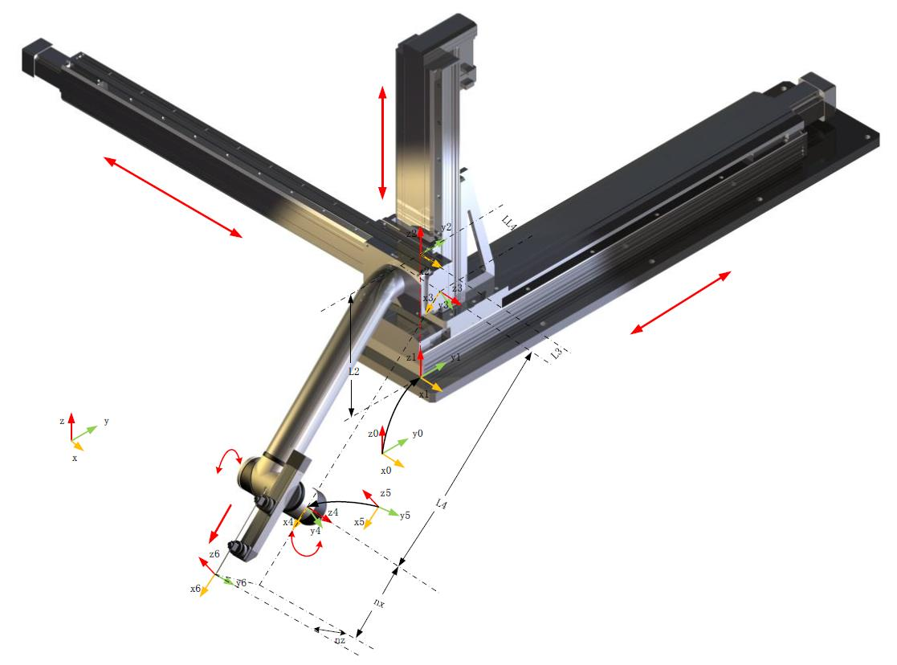
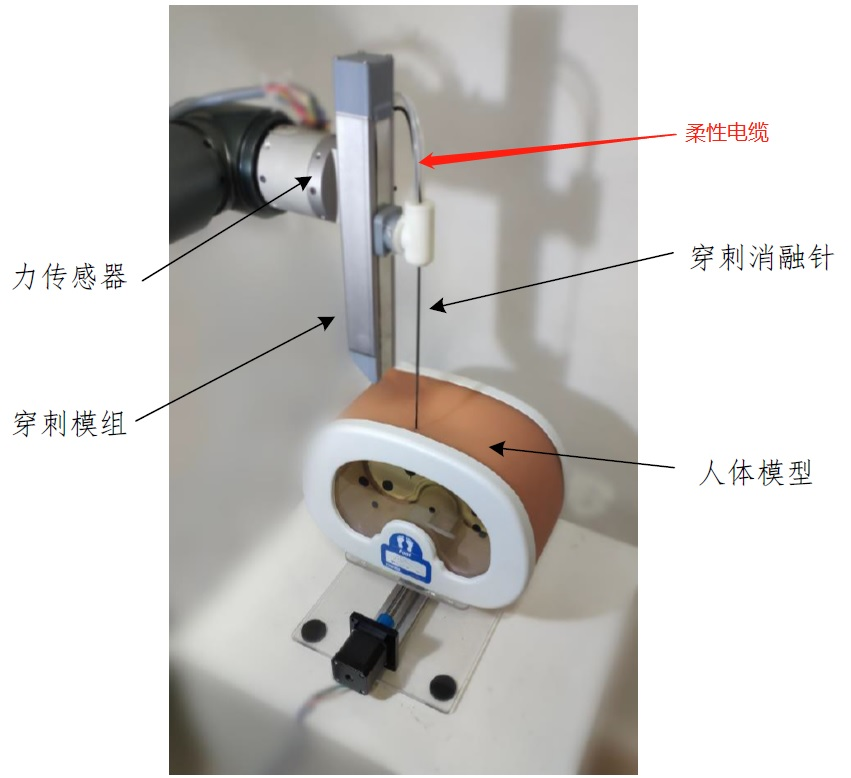

* 本文将在实验室的6自由度医疗穿刺手术机器人（见上图）上对该算法进行复现，该机器人具有XYZ三轴平动自由度、αβ两轴转动自由度及B一轴平动进针自由度，在机器人末端有六维力传感器，采集FxFyFzTxTyTz六轴力与力矩信号，穿刺针上有柔性电缆，其质心难以精确建模估计，但却具有很强的重复规律性，故不适合用传统方法进行重力补偿，因此本文构建了一个轻量级的BP神经网络，估计出不同姿态下六维力信号中的重力分量，实现重力补偿，并在此基础上，结合机器人动力学相关理论，实现机械臂的拖动示教(见下图)。

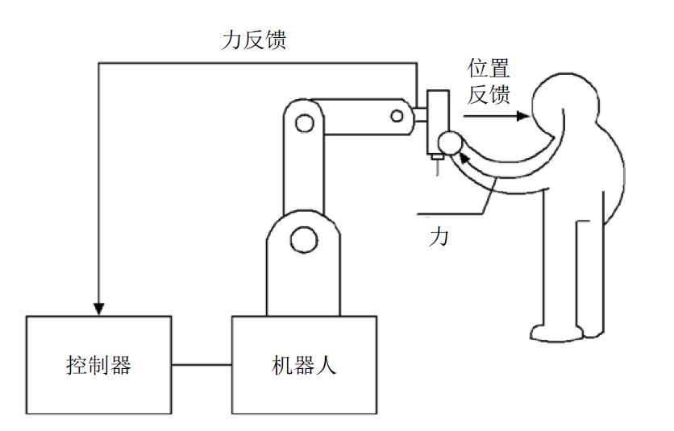

* **复现思路：**
由于XYZ三轴不对六维力前端机构的姿态产生影响，即不会对重力补偿项产生影响，故只考虑α、β、B三轴对重力补偿的影响。为了预测出六轴力与力矩信号中的重力分量，本文在不加负载的情况，让α、β、B三轴在运动范围内，分别或同时运动一定角度，采集整个过程中的角度位移值与六维力信号，以此作为训练样本对BP神经网络进行训练，要求技术参数如下：
* 1、α角范围：-45~+45°
* 2、β角范围：-45~+45°
* 3、B运动范围：0~140mm
* 4、控制周期：8ms
* 5、最小拖动力：0.2N

* **实现方法：**
* 1、输入输出：输入为α、β、B实际角度位移值X=[α，β，B]'，输出为六轴力与力矩信号中的重力分量Y=[Fx,Fy,Fz,Tx,Ty,Tz]'
* 2、网络结构：3-20-6
* 3、激活函数：Sigmoid
* 4、数据样本：1060组用于训练、530组用于预测
* 5、训练算法：梯度下降法，训练10000次
* 6、损失函数：均方误差MSE
* 7、动力学方法：牛顿-欧拉法+阻抗控制（控制框图如下，具体算法因不是本文的重点故不详细叙述）

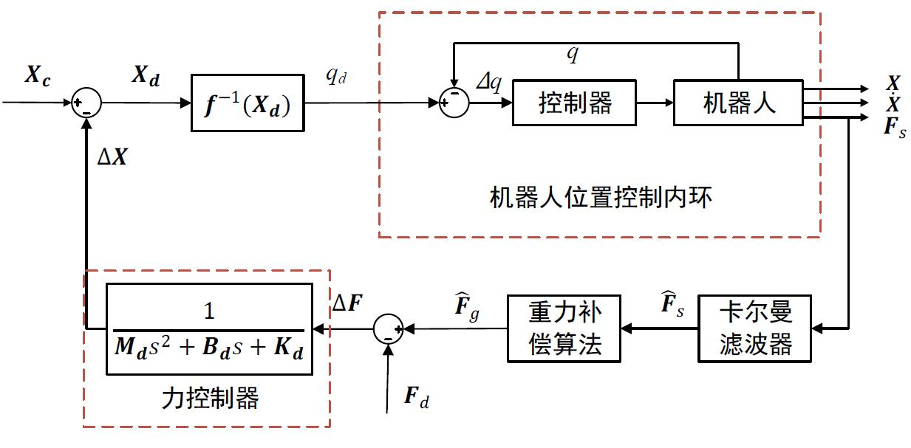

* **编程环境：**
* 1、网络训练部分：MATLAB
* 2、机器人控制部分：TwinCAT（因不是本文的重点故不详细叙述）

### 完成实验
* **主要公式**
* 
* 
* 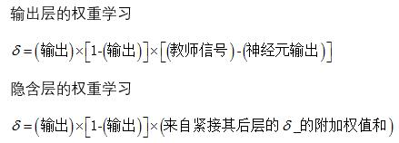

* **MATLAB部分代码：（完整代码见源文件）**
<pre name="code" class="MATLAB">
%****************************
%目的：BP神经网络的主程序，网络结构3-20-6
%时间：2019/4/13
%程序员：Jarvis
%****************************

%************* 将数据分为训练组和预测组 ***************
clear;clc;close all;
load TrainData; %训练数据共10600组
Data_y = TrainData(:,4:9);
Data_x = TrainData(:,1:3);
Data_y = Data_y';
Data_x = Data_x';
Data_size = size(Data_x,2); %Data_size=10600
RandSelect = randperm(Data_size); %生成10600的随机数序列
ratioTrain = 0.1; %10600中的训练部分比例
ratioPredict = 0.05; %10600中的预测部分比例
Data_size_Train=floor(ratioTrain*Data_size); %10600中的训练部分的大小
Data_size_Predict=floor(ratioPredict*Data_size); %10600中的预测部分的大小

Train_x = [];
Train_y = [];  
for ii=1:Data_size_Train
    Train_x = [Train_x,Data_x(:,RandSelect(ii))];%随机选择10600中的训练部分
    Train_y = [Train_y,Data_y(:,RandSelect(ii))];
end
Train_x = Train_x';  
Train_y = Train_y';

Predict_x = [];
Predict_y = [];
for ii=Data_size_Train+1:Data_size_Train+Data_size_Predict
    Predict_x = [Predict_x,Data_x(:,RandSelect(ii))];%随机选择10600中的测试部分
    Predict_y = [Predict_y,Data_y(:,RandSelect(ii))];
end
Predict_x = Predict_x';
Predict_y = Predict_y';  

%************* 创建网络(均为正负1中间的随机数) ***************
NN_Num_X=3; %输入层
NN_Num_L=20; %隐含层
NN_Num_Y=6; %输出层
NN_Y=zeros(NN_Num_Y,Data_size_Predict);%输出结果
NN_Wl=2*rand(NN_Num_X,NN_Num_L)-ones(NN_Num_X,NN_Num_L); %隐含层权重
NN_Bl=2*rand(NN_Num_L,1)-ones(NN_Num_L,1);%隐含层阈值
NN_Wo=2*rand(NN_Num_L,NN_Num_Y)-ones(NN_Num_L,NN_Num_Y); %输出层权重
NN_Bo=2*rand(NN_Num_Y,1)-ones(NN_Num_Y,1);%输出层阈值
MaxEpoch=10000; %最大训练量
Goal=0.0001; %目标方差
LearningRatio1=0.1;%输出层学习率
LearningRatio2=0.1;%输出层学习率
Mse_record=zeros(MaxEpoch,1);%损失函数值记录

%************* 训练网络(损失函数为MES) ***************
for Epoch=1:MaxEpoch
    NN_Y=Jarvis_NN_Predict(Predict_x,NN_Wo,NN_Bo,NN_Wl,NN_Bl);%预测输出

    Midd=0;
    for ii=1:Data_size_Predict
        for jj=1:NN_Num_Y
           Midd=Midd+(NN_Y(ii,jj)-Predict_y(ii,jj))^2; %计算平方和
        end
    end
    Mse_record(Epoch,1)=Midd/Data_size_Predict/NN_Num_Y;%计算MSE
    disp(['Epoch = ' num2str(Epoch) ', MSE = ' num2str(Mse_record(Epoch,1))]);

    if Mse_record(Epoch,1)>Goal %如果没达到要求
        [NN_Wo,NN_Bo,NN_Wl,NN_Bl]=Jarvis_NN_Train(Train_x,Train_y,NN_Wo,NN_Bo,NN_Wl,NN_Bl,LearningRatio1,LearningRatio2);%训练网络
    else
        break
    end
end
</pre>
* **输出结果：**
* MATLAB运行结果
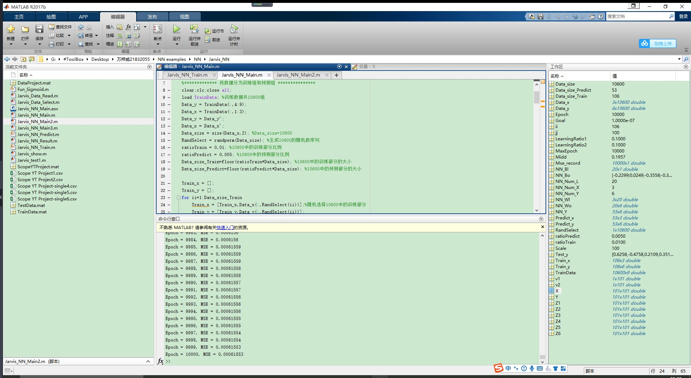

* 损失函数图像
* 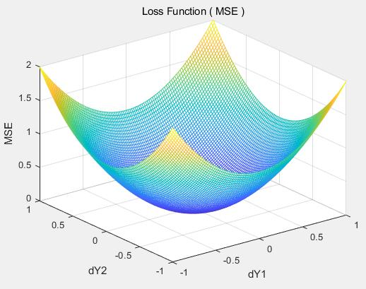
* 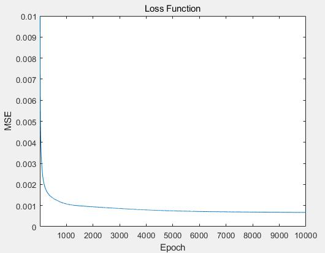

* **训练结果可视化：**
* 神经网络输出结果（都在B=0mm情况下，以α与β为自变量，黑圈为部分实验数据）
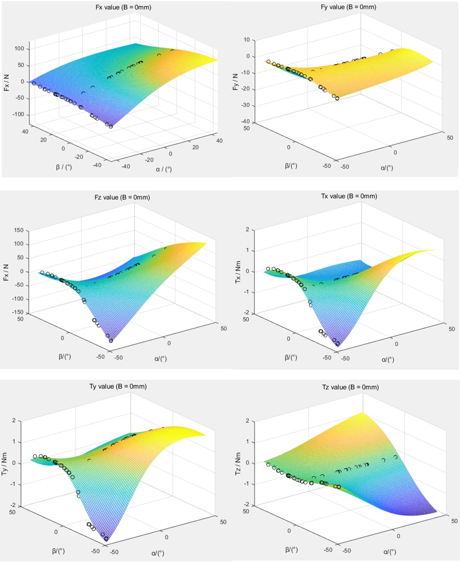

* **拖动示教实验结果：**
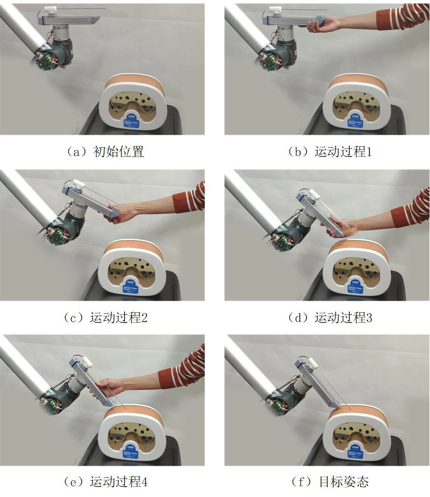

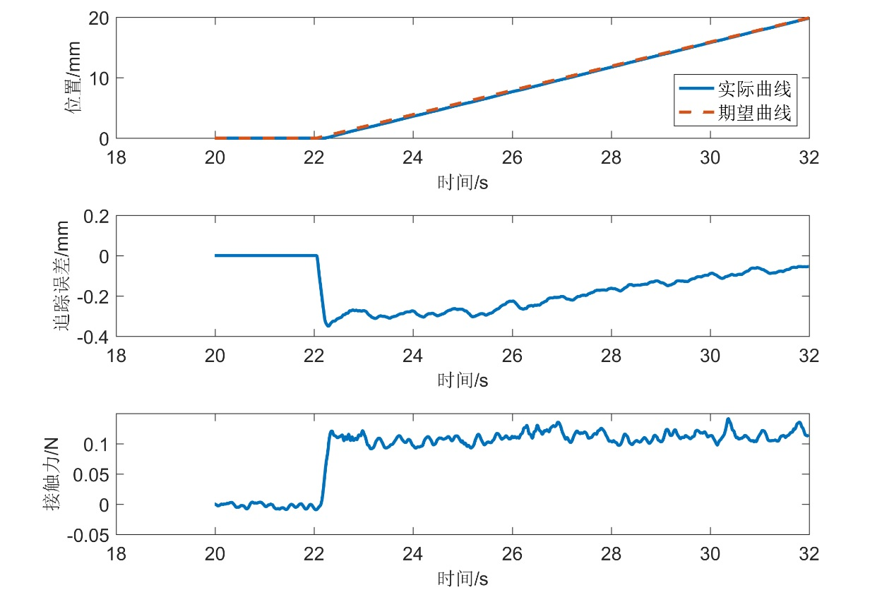

* 图中上下三部分别为位置跟踪情况，随误差以及此方向所受的接触力。从图中可以看出0.23秒之后机器人已经能够跟踪上给定信号，跟随误差小于0.4mm，而且随着时间的延长，跟随误差也渐减小偏向于着时间的延长，跟随误差也渐减小偏向于0，而所受到的接触力基本稳定在0.1N左右，满足设计要求，也间接说明重力补偿的精度很高。

### 撰写报告
* **工作总结：**
* 本文在实验室的6自由度机器人上采用BP神经网络对重力项进行补偿，为适应机器人的快速响应性，神经网络只采用了3层结构（3-20-6）与梯度下降法，实验证明，该网络对机器人重力项具有较好的拟合效果，且实时性较好，从而可以实时估计出不同姿态下六维力信号中的重力分量，实现重力补偿。
在此基础上，本文采用阻抗控制的方式，实现机械臂的微小力拖动示教，通过实验验证，机器人在0.23秒以内即实现了力跟踪，跟随误差小于0.4mm，且随着时间的延长逐渐趋近于0，其接触力基本稳定在0.1N左右，满足设计要求。
