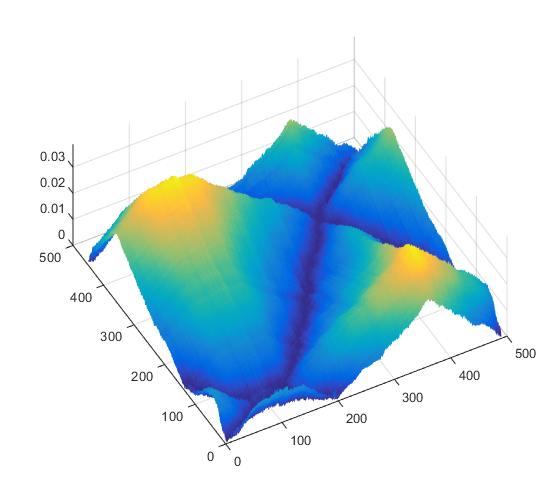
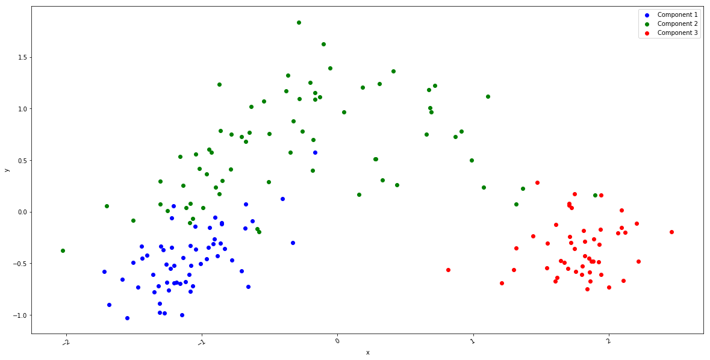
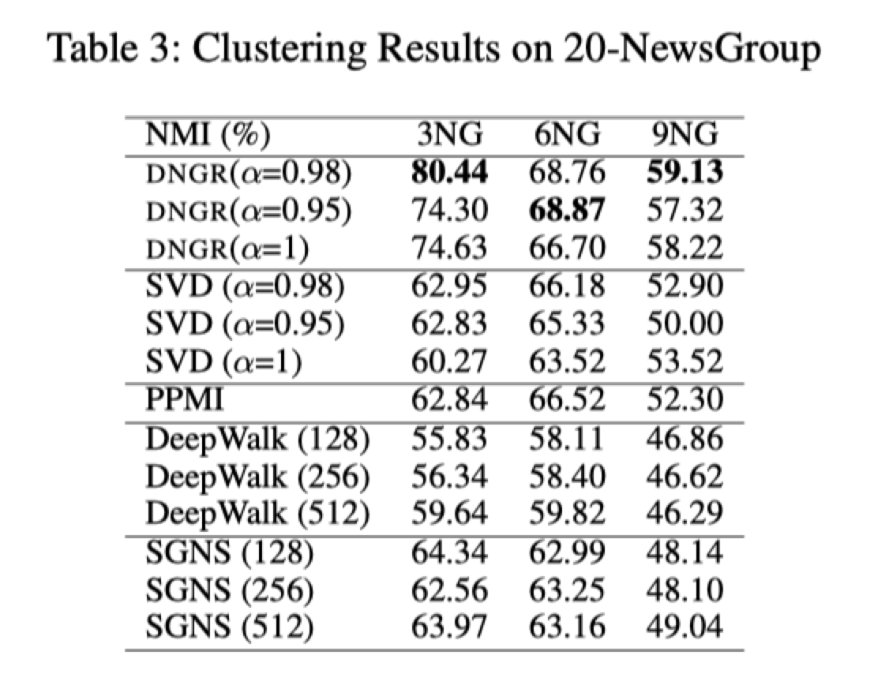

### About me
* **Name**: 李博浪
* **Student ID**: 21821210  
* **Topic**: Neural Networks

### Schedule

| Task | Due | Done |
| :--:| :--: | :--: |
| 1.选择论文 | Mar.14 | Y |
| 2.精读论文 | Mar.21 | Y
| 3.复现论文 | Apr.4 | N
| 4. 完成实验 | Apr.11 | N
| 5.撰写报告 | Apr.18 | N

### 选择论文
[Deep Neural Networks for Learning Graph Representations AAAI 2016](DNGR.pdf)  

* **摘要**
> &ensp;本文提出了一种新的模型,通过捕获图的结构特征,从而能够学习图的表示,为图中每个节点生成低维向量.与以往的基于采样的模型不同,DNGR主要通过随机搜索从而直接捕获图的结构信息.本文主要使用堆叠去噪自编码器去抽取PMI矩阵中的复杂的非线性特征.为了证明模型的有效性,作者利用了模型所学习到的节点的向量,来完成聚类及可视化任务等.
### 精读论文
>本文通过捕获图的特征结构来学习图的表示,为图中每个节点生成低维向量.本文可用于带权图,而且还能捕获图中的非线性关系.  
本文算法主要分为三个步骤:  
&emsp;1.使用random surfing模型捕获图的结构,并获得过线概率矩阵PCO  
&emsp;2.基于PCO来计算PPMI矩阵  
&emsp;3.利用堆叠去噪自编码器来学习节点的低维表示  
1.random surfing  
&emsp;$p_{k}=\alpha p_{k-1}A+(1-\alpha )p_{0}$  
&emsp;$r=\sum_{k=1}^{K}p_{k}$  
即通过转移概率矩阵来求得节点的k跳所能到达节点的概率,然后通过加权和获得节点的概率共现矩阵PCO.  
2.基于PCO来计算PPMI矩阵  
&emsp;$PMI_{w,c}=log(\frac{\#(w,c)\cdot \left | D \right |)}{\#(w)\cdot \#(c)}))$  
&emsp;$$PPMI_{w,c}=max(PMI_{w,c},0)$$  
通过节点的概率共现矩阵获得PPMI矩阵  
3.利用堆叠去噪自编码器来学习节点的低维表示  
将PPMI矩阵中节点对应的向量作为输入,放入SDAE里,获取节点的低维向量表示.并使用逐层的贪婪预训练.最终获得节点的低维向量表示

### 模型结构与实验结果


### 复现论文
#### random surfing
```python
 def random_surfing(matrix,alpha=0.98,steps=10):
    nodes_count=len(matrix)
    p0=np.eye(nodes_count,dtype='float64')
    result=np.zeros((nodes_count,nodes_count),dtype='float64')
    p=p0.copy()
    for i in range(steps):
        p=alpha*np.dot(p,matrix)+(1-alpha)*p0
        result=result+p
    #result=result/result.sum(axis=1).reshape(-1,1)
    result=scale_sim_mat(result)
    return result
```

#### PPMI
```python
def get_PPMI(matrix):
    
    node_counts=len(matrix)
    D=matrix.sum()
    row_sum=matrix.sum(axis=1).reshape(-1,1)
    column_sum=matrix.sum(axis=0).reshape(1,-1)
    PPMI=np.log(np.divide(D*matrix,np.dot(row_sum,column_sum)))
    PPMI[np.isnan(PPMI)]=0
    PPMI[np.isinf(PPMI)] = 0.0
    PPMI[np.isneginf(PPMI)] = 0.0
    PPMI[PPMI<0]=0
    return PPMI
```
#### train
```python
def train(data,hidden_layer=3,hidden_neurons=[128,64,32]):
    input_layer=Input(shape=(data.shape[1],))
    encoder=noise.GaussianNoise(0.2)(input_layer)
    for i in range(hidden_layer):
        encoder=Dense(hidden_neurons[i],activation='relu')(encoder)
        encoder=noise.GaussianNoise(0.2)(encoder)
    decoder=Dense(hidden_neurons[-2],activation='relu')(encoder)
    for j in range(hidden_layer-3,-1,-1):
        decoder=Dense(hidden_neurons[j],activation='relu')(decoder)
    decoder=Dense(data.shape[1],activation='sigmoid')(decoder)

    sdae=Model(input=input_layer,output=decoder)
    sdae.summary()
    sdae.compile(optimizer='adadelta',loss='mse')
    sdae.fit(data,data,steps_per_epoch=20,epochs=10)
    return Model(input=input_layer,output=encoder)
        

```


### 完成实验
loss仿真

分类结果


实验结果

