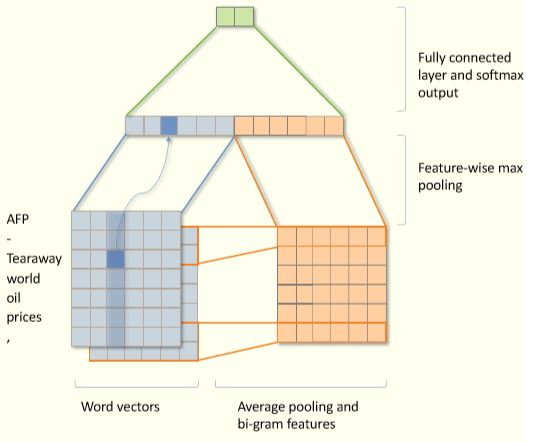
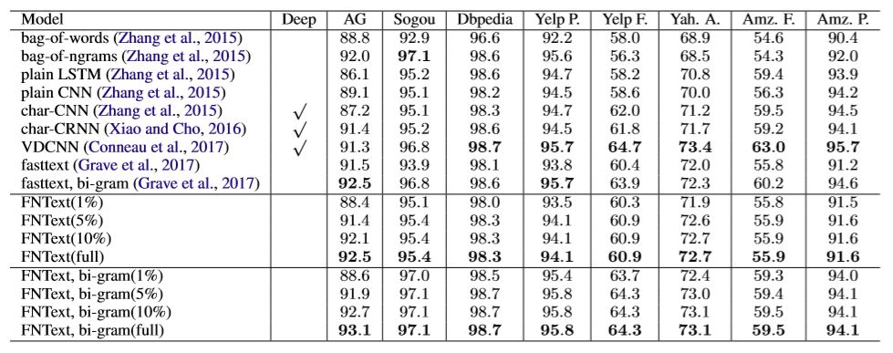
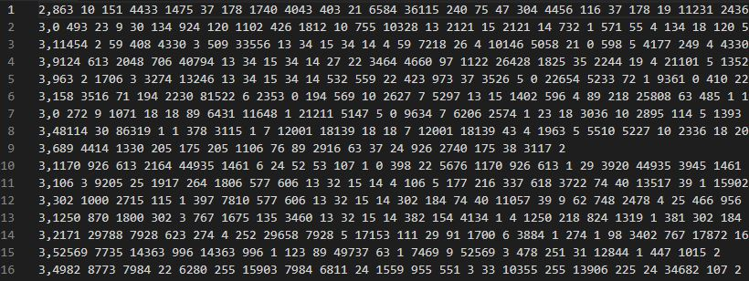
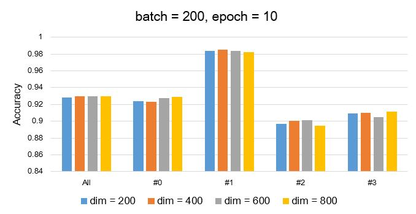
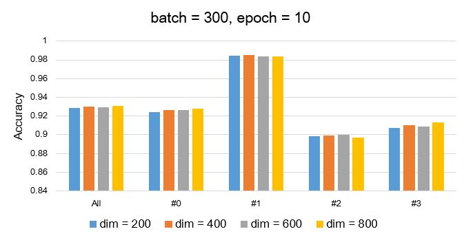
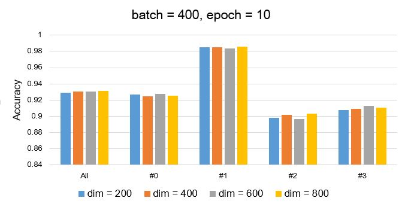
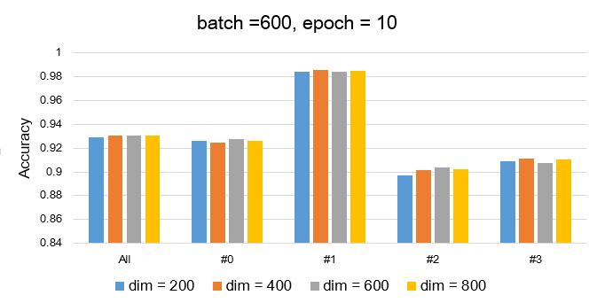
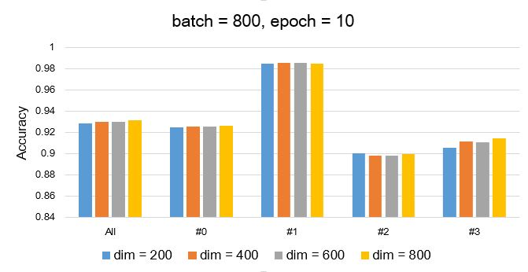
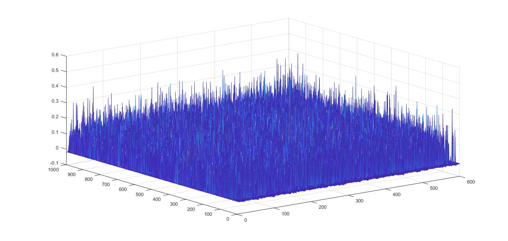
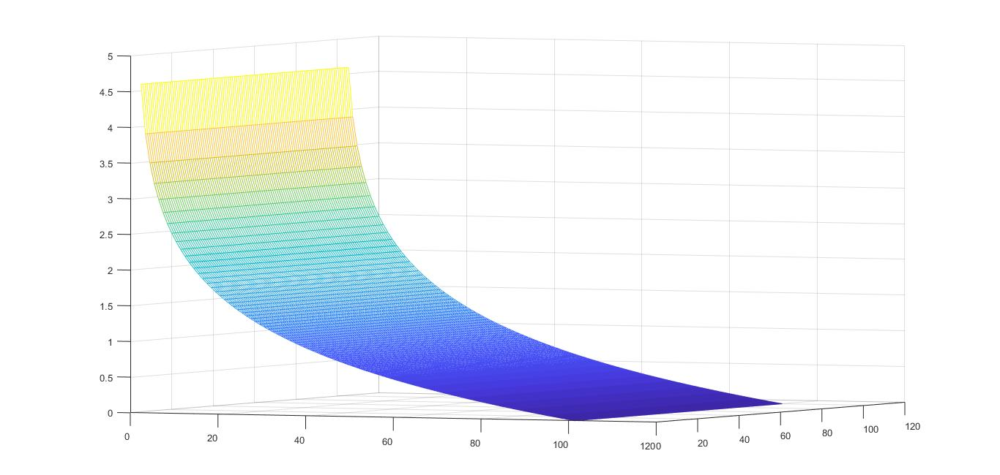

### About me
* **Name**: 李宇渊  
* **Student ID**: 11821022  
* **Topic**: Neural Networks
### Schedule

Task|Due|Done
-|:-:|:-:
1.选择论文|Mar.14|T
2.精读论文|Mar.21|T
3.复现论文|Apr.4|T
4.完成实验|Apr.11|T
5.实验总结|Apr.18|T  
### 选择论文
[FNText: A Fast Neural Model for Efficient Text Classification](Fntext.pdf)  
这篇论文利用神经网络进行文本分类。传统方法大多利用CNN和RNN等结构搭建深度神经网络，这篇论文构建了一个简单高效的三层神经网络。该模型训练时间短，计算资源要求低，准确率也较为出色。  
* **Abstract**
>In recent years,very deep neural models based convolutional neural networks (CNNs) have achieved remarkable results in natural language processing (NLP). However, the computational complexity also largely increasesas the networks go deeper, which causes long training time. To raise the efficiency of calculation, this paper focus on shallow neural model and explores a fast neural text classification model FNText, which only contains 3 layers,without activation function and stacked time-consuming convolutional layers. Instead of enumerating a bag of bi-grams, we propose a novel method which utilizes average pooling operation along randomly initializing word vectors to obtain bi-gram features. These additional bi-gramfeatures can further improve the performance of FNText. We improve the training speed by ignoring hyperparameters with zero-gradients. Experiments show that FNText can be trained on more than 300 million words in less than 10 minutes using a standard multicore CPU, and achieves competitive results on several large-scale datasets. Sometimes FNText is on par with very deep neural models.
### 精读论文
#### 中心思想
* 就测试准确率而言，该模型可以达到甚至超越深度网络模型；
* 该模型层数少，无激活函数，训练速度快，可以在一个标准多核CPU上训练；
* 该模型无RNN等循环结构，可以并行训练。
#### 模型结构
论文中提出了该模型的两种版本，without bi-gram和with bi-gram。without bi-gram版本的模型已经可以取得不错的效果，利用了bi-gram以后，模型的效果更加理想。其中利用了bi-gram的具体结构如下如所示：  
  
该结构对每个词随机产生一个词向量，然后对词向量的每个维度进行max pooling，最后输入一层全连接神经网络进行softmax分类。
#### 训练方法
Adam
#### 实验结果
作者在多个数据集上进行了对比实验，结果如下图所示：

### 复现论文
[训练集](src/train.txt)
[测试集](src/test.txt)
[实验代码](src/fntext_bi.c)  
数据集的内容如下图所示：  
* 每一行为一段文字
* 每一行第一个数字为文本类别的标签
* 每一行逗号后的数字为word index，一个word用一个数字表示，每个数字用空格隔开  

### 完成实验
* Parameter: batch size = 200, epoch = 10  
* Result:

Embedding Dim|Label|Ave Acc|Embedding Dim|Label|Ave Acc|
-|:-:|:-:|:-:|:-:|:-:|
200|All|0.928657|600|All|0.929578
200|#0|0.924263|600|#0|0.927896
200|#1|0.983896|600|#1|0.983895
200|#2|0.896893|600|#2|0.901474
200|#3|0.909579|600|#3|0.905053
400|All|0.929644|800|All|0.929565
400|#0|0.923000|800|#0|0.929369
400|#1|0.984948|800|#1|0.982738
400|#2|0.900737|800|#2|0.894947
400|#3|0.909895|800|#3|0.911211

* Parameter: batch size = 300, epoch = 10  
* Result:

Embedding Dim|Label|Ave Acc|Embedding Dim|Label|Ave Acc|
-|:-:|:-:|:-:|:-:|:-:|
200|All|0.928579|600|All|0.929671
200|#0|0.924527|600|#0|0.926473
200|#1|0.984368|600|#1|0.983789
200|#2|0.898262|600|#2|0.899789
200|#3|0.907156|600|#3|0.908632
400|All|0.930184|800|All|0.930528
400|#0|0.926264|800|#0|0.928106
400|#1|0.985106|800|#1|0.983790
400|#2|0.899420|800|#2|0.896999
400|#3|0.909947|800|#3|0.913212

* Parameter: batch size = 400, epoch = 10  
* Result:

Embedding Dim|Label|Ave Acc|Embedding Dim|Label|Ave Acc|
-|:-:|:-:|:-:|:-:|:-:|
200|All|0.929237|600|All|0.930211
200|#0|0.926579|600|#0|0.927526
200|#1|0.984894|600|#1|0.983788
200|#2|0.897843|600|#2|0.896526
200|#3|0.907633|600|#3|0.913000
400|All|0.930211|800|All|0.931132
400|#0|0.924578|800|#0|0.925419
400|#1|0.984948|800|#1|0.985632
400|#2|0.901843|800|#2|0.903212
400|#3|0.909475|800|#3|0.910262

* Parameter: batch size = 500, epoch = 10  
* Result:

Embedding Dim|Label|Ave Acc|Embedding Dim|Label|Ave Acc|
-|:-:|:-:|:-:|:-:|:-:|
200|All|0.928855|600|All|0.930421
200|#0|0.923789|600|#0|0.926368
200|#1|0.984789|600|#1|0.984526
200|#2|0.898579|600|#2|0.897579
200|#3|0.908263|600|#3|0.913211
400|All|0.930040|800|All|0.930027
400|#0|0.925368|800|#0|0.925578
400|#1|0.985422|800|#1|0.984892
400|#2|0.901104|800|#2|0.897156
400|#3|0.908263|800|#3|0.912473

* Parameter: batch size = 600, epoch = 10  
* Result:

Embedding Dim|Label|Ave Acc|Embedding Dim|Label|Ave Acc|
-|:-:|:-:|:-:|:-:|:-:|
200|All|0.929225|600|All|0.930960
200|#0|0.926053|600|#0|0.927948
200|#1|0.984579|600|#1|0.984528
200|#2|0.897366|600|#2|0.903737
200|#3|0.908893|600|#3|0.907633
400|All|0.930685|800|All|0.930959
400|#0|0.924947|800|#0|0.926053
400|#1|0.985528|800|#1|0.984999
400|#2|0.901316|800|#2|0.902420
400|#3|0.910946|800|#3|0.910369

* Parameter: batch size = 700, epoch = 10  
* Result:

Embedding Dim|Label|Ave Acc|Embedding Dim|Label|Ave Acc|
-|:-:|:-:|:-:|:-:|:-:|
200|All|0.929421|600|All|0.930500
200|#0|0.925054|600|#0|0.925421
200|#1|0.985104|600|#1|0.985685
200|#2|0.899052|600|#2|0.900262
200|#3|0.908473|600|#3|0.910631
400|All|0.930183|800|All|0.930947
400|#0|0.924422|800|#0|0.926000
400|#1|0.985475|800|#1|0.984895
400|#2|0.899369|800|#2|0.899106
400|#3|0.911474|800|#3|0.913789

* Parameter: batch size = 800, epoch = 10  
* Result:

Embedding Dim|Label|Ave Acc|Embedding Dim|Label|Ave Acc|
-|:-:|:-:|:-:|:-:|:-:|
200|All|0.928949|600|All|0.930305
200|#0|0.924948|600|#0|0.926054
200|#1|0.984685|600|#1|0.985791
200|#2|0.900631|600|#2|0.898420
200|#3|0.905527|600|#3|0.910947
400|All|0.930224|800|All|0.931395
400|#0|0.925526|800|#0|0.926318
400|#1|0.985422|800|#1|0.985106
400|#2|0.898474|800|#2|0.899684
400|#3|0.911475|800|#3|0.914472

#### Final parameter
* batch size = 600
* embedding dim = 600

### 实验总结
#### 模型仿真

#### Loss仿真

