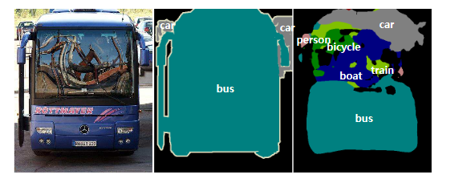
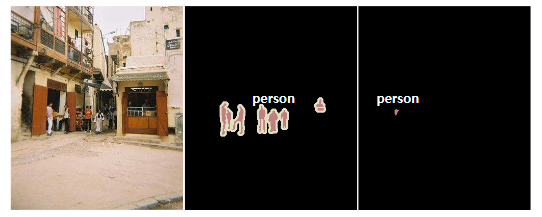
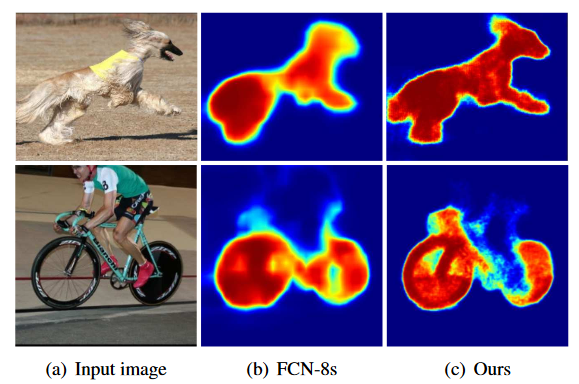
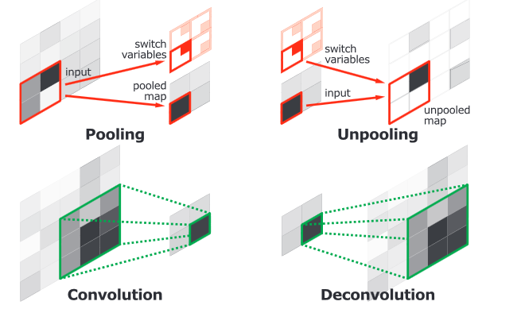

# 生物智能算法 神经网络组

## Personal information
+ Name: 程书意
+ Student ID: 21821255
+ Email: 1541189572@qq.com

---

## Timeline

|Task|Date|Done|
--|--|:--:
1.选择论文|Mar. 14|
2.精读论文，理解模型|Mar. 21|
3.复现论文|Apr. 4|
4.完成对比实验|Apr. 11|
5.形成报告|Apr. 18|

---

## 1. 选择论文

[Learning Deconvolution Network for Semantic Segmentation](https://arxiv.org/abs/1505.04366)

> [IEEE 2015 IEEE International Conference on Computer Vision (ICCV) - Santiago, Chile (2015.12.7-2015.12.13)] 2015 IEEE International Conference on Computer Vision (ICCV) - Learning Deconvolution Network for Semantic Segmentation

### 1.1 Abstract

We propose a novel semantic segmentation algorithm by learning a deconvolution network. We learn the network on top of the convolutional layers adopted from VGG 16-layer net. The deconvolution network is composed of deconvolution and unpooling layers, which identify pixel-wise class labels and predict segmentation masks. We apply the trained network to each proposal in an input image, and construct the final semantic segmentation map by combining the results from all proposals in a simple manner. The proposed algorithm mitigates the limitations of the existing methods based on fully convolutional networks by integrating deep deconvolution network and proposal-wise prediction; our segmentation method typically identifies detailed structures and handles objects in multiple scales naturally. Our network demonstrates outstanding performance in PASCAL VOC 2012 dataset, and we achieve the best accuracy (72.5%) among the methods trained with no external data through ensemble with the fully convolutional network.

### 1.2 摘要

作者提出了一个新颖的通过学习反卷积网络来进行语义分割的算法。作者在来VGG16层的卷积层之上来构建学习网络。反卷积网络由反卷积和反池化层组成，用来确定像素级别的类别标签预测分割掩码。对于每个输入图像，作者将训练好的网络应用到每一个方案中，然后通过一个简单的方式将所有方案的结果结合，来构建最后的语义分割映射。作者提出的算法通过整合深度反卷积网络和每个方案的预测结果，减轻了现有的基于全卷积网络的方法的限制；该分割方法常常自然地确定精细的结构，并且处理多个尺度的物体。我们的网络在PASCAL VOC 2012数据集上展现出杰出的性能，我们在那些没有额外数据的训练方法中，通过与全卷积网络整合，最终获得了72.5％的准确率。

## 2. 精读论文，理解模型

### 2.1 简介

##### 2.1.1 FCN VS. DCN

* 固定尺寸的感受野

    - 对于大尺度目标，只能获得该目标的**局部信息**，该目标的一部分将被错误分类；

    - 对于小尺度目标，很容易被忽略或当成背景处理；


* 目标的细节结构容易丢失，边缘信息不够好。全卷积神经网络得到的分类图过于粗糙，而用于上采样的反卷积操作过于简单；



#### 2.1.2 贡献

* 作者学习了一个多层反卷积网络，它由反卷积、反池化和ReLU层组成。

* 训练的模型被用来进行单个物体的提出，以获得实例级别的分割，并最终结合到语义分割中。这种模型消除了在基于FCN模型中发现的尺度问题，同时更好的确定了物体的细节。

* 作者使用反卷积网络，在仅在PASCAL VOC 2012数据集上训练的情况下就取得了很好的效果，通过利该算法相对于基于FCN模型的异质性和互补性，与FCN模型进行集成并获得了最好的准确率。

### 2.2 系统结构

作者训练的网络由**卷积网络**和**反卷积网络**两部分组成。卷积网络与将输入图像转化到多维度特征表示的**特征抽取**相对应，而反卷积网络是一个从卷积网络得到的抽取的特征来得到目标分割的的形状生成器。网络最终的输出使用和输入图像大小一致的概率映射，**表明了每个像素属于某一预定义分类的概率**。

作者使用去除了最后分类层的VGG16层网络作为卷积部分。该卷积网络一共有13个卷积层，在卷积层之间有rectification和池化操作，在最后增加两个全连接层来进行特定类的映射。反卷积网络是卷积网络的镜像版本，有多个系列的反池化、反卷积和规范化层。与卷积网络中通过前馈来减少激活大小不同，反卷积网络通过将反池化和反卷积操作结合来增大激活大小。


* 反池化

池化在卷积网络中被设计用来通过在一个感受野内抽取一个代表值来过滤噪声。尽管这通过在上层仅保留鲁棒的像素点来帮助分类，但是在池化的过程中感受野内的**空间信息丢失**了，这对于语义分割所需要的精确位置来说是十分关键的。为了解决这个问题，我们在反卷积网络中使用反池化层，它进行池化的逆操作，并像图3所展示的那样重构至原始大小的图像。为了实施反池化操作，作者使用转换变量（switch variables）中记录了在池化操作时选择的最大像素的位置，并在反池化时将像素复原到其原来的位置。这种反池化策略在重建输入物体的结构时尤其有用。

* 反卷积

反池化层的输出大小扩大了，但仍然是**稀疏的映射**。反卷积层通过多层类似卷积的滤波，将由反池化层获得的稀疏图增加密度。然而，与将多个输入像素通过滤波窗口变成一个像素的卷积层不同，反卷积层将一个输入像素与多个输出相联系。反卷积层的输出是扩大而且变密的像素。我们将扩大的像素映射的边缘裁去，以保持输出大小和之前的反池化层一致。在反卷积层中学习的滤波是重建输入物体的形状的基础。因此，与卷积网络相似，反卷积层的层次结构被用来获取不同类的形状细节。底层的滤波倾向于获取一个物体的整体形状，特定类的精细细节被编码在高层滤波中。通过这种方式，网络直接在语义分割时考虑到了特定类的形状信息。



## 3. 复现论文

```
import tensorflow as tf

from tensorflow.keras import Model, Input
from tensorflow.keras.layers import Conv2D, MaxPooling2D, Conv2DTranspose, Lambda, Layer, BatchNormalization, Activation
from tensorflow.keras import backend as K
from tensorflow.keras.models import load_model, save_model
from tensorflow.keras.applications import VGG16

import os
import random
import time
import wget
import tarfile
import numpy as np
import cv2

class MaxUnpoolWithArgmax(Layer):

    def __init__(self, pooling_argmax, stride = [1, 2, 2, 1], **kwargs):
        self.pooling_argmax = pooling_argmax    
        self.stride = stride
        super(MaxUnpoolWithArgmax, self).__init__(**kwargs)
        
    def build(self, input_shape):
        super(MaxUnpoolWithArgmax, self).build(input_shape)

    def call(self, inputs):
        input_shape = K.cast(K.shape(inputs), dtype='int64')

        output_shape = (input_shape[0],
                        input_shape[1] * self.stride[1],
                        input_shape[2] * self.stride[2],
                        input_shape[3])

        #output_list = []
        #output_list.append(self.pooling_argmax // (output_shape[2] * output_shape[3]))
        #output_list.append(self.pooling_argmax % (output_shape[2] * output_shape[3]) // output_shape[3])
        argmax = self.pooling_argmax #K.stack(output_list)

        one_like_mask = K.ones_like(argmax)
        batch_range = K.reshape(K.arange(start=0, stop=input_shape[0], dtype='int64'), 
                                 shape=[input_shape[0], 1, 1, 1])

        b = one_like_mask * batch_range
        y = argmax // (output_shape[2] * output_shape[3])
        x = argmax % (output_shape[2] * output_shape[3]) // output_shape[3]
        feature_range = K.arange(start=0, stop=output_shape[3], dtype='int64')
        f = one_like_mask * feature_range
        # transpose indices & reshape update values to one dimension
        updates_size = tf.size(inputs)
        indices = K.transpose(K.reshape(K.stack([b, y, x, f]), [4, updates_size]))
        values = K.reshape(inputs, [updates_size])
        return tf.scatter_nd(indices, values, output_shape)

    def compute_output_shape(self, input_shape):
        return (input_shape[0], input_shape[1] * 2, input_shape[2] * 2, input_shape[3])

    def get_config(self):
        base_config = super(MaxUnpoolWithArgmax, self).get_config()
        base_config['pooling_argmax'] = self.pooling_argmax
        base_config['stride'] = self.stride
        return base_config

    @classmethod
    def from_config(cls, config):
        return cls(**config)


class DeconvNet:
    def __init__(self, use_cpu=False, print_summary=False):
        self.maybe_download_and_extract()
        self.build(use_cpu=use_cpu, print_summary=print_summary)

        
    def maybe_download_and_extract(self):
        """Download and unpack VOC data if data folder only contains the .gitignore file"""
        if os.listdir('data') == ['.gitignore']:
            filenames = ['VOC_OBJECT.tar.gz', 'VOC2012_SEG_AUG.tar.gz', 'stage_1_train_imgset.tar.gz', 'stage_2_train_imgset.tar.gz']
            url = 'http://cvlab.postech.ac.kr/research/deconvnet/data/'

            for filename in filenames:
                wget.download(url + filename, out=os.path.join('data', filename))

                tar = tarfile.open(os.path.join('data', filename))
                tar.extractall(path='data')
                tar.close()

                os.remove(os.path.join('data', filename))

                
    def predict(self, image):
        return self.model.predict(np.array([image]))
    
    def save(self, file_path='model.h5'):
        print(self.model.to_json())
        self.model.save_weights(file_path)
        
    def load(self, file_path='model.h5'):
        self.model.load_weights(file_path)
    
    def random_crop_or_pad(self, image, truth, size=(224, 224)):
        assert image.shape[:2] == truth.shape[:2]

        if image.shape[0] > size[0]:
            crop_random_y = random.randint(0, image.shape[0] - size[0])
            image = image[crop_random_y:crop_random_y + size[0],:,:]
            truth = truth[crop_random_y:crop_random_y + size[0],:]
        else:
            zeros = np.zeros((size[0], image.shape[1], image.shape[2]), dtype=np.float32)
            zeros[:image.shape[0], :image.shape[1], :] = image                                          
            image = np.copy(zeros)
            zeros = np.zeros((size[0], truth.shape[1]), dtype=np.float32)
            zeros[:truth.shape[0], :truth.shape[1]] = truth
            truth = np.copy(zeros)

        if image.shape[1] > size[1]:
            crop_random_x = random.randint(0, image.shape[1] - size[1])
            image = image[:,crop_random_x:crop_random_x + 224,:]
            truth = truth[:,crop_random_x:crop_random_x + 224]
        else:
            zeros = np.zeros((image.shape[0], size[1], image.shape[2]))
            zeros[:image.shape[0], :image.shape[1], :] = image
            image = np.copy(zeros)
            zeros = np.zeros((truth.shape[0], size[1]))
            zeros[:truth.shape[0], :truth.shape[1]] = truth
            truth = np.copy(zeros)            

        return image, truth

    #(0=background, 1=aeroplane, 2=bicycle, 3=bird, 4=boat, 5=bottle, 6=bus, 7=car , 8=cat, 9=chair, 
    # 10=cow, 11=diningtable, 12=dog, 13=horse, 14=motorbike, 15=person, 16=potted plant, 
    # 17=sheep, 18=sofa, 19=train, 20=tv/monitor, 255=no_label)

    def max_pool_with_argmax(self, x):
        return tf.nn.max_pool_with_argmax(x, ksize=[1, 2, 2, 1], strides=[1, 2, 2, 1], padding='SAME')
    
    def BatchGenerator(self, train_stage=1, batch_size=8, image_size=(224, 224, 3), labels=21):
        if train_stage == 1:
            trainset = open('data/stage_1_train_imgset/train.txt').readlines()
        else:
            trainset = open('data/stage_2_train_imgset/train.txt').readlines()

        while True:
            images = np.zeros((batch_size, image_size[0], image_size[1], image_size[2]))
            truths = np.zeros((batch_size, image_size[0], image_size[1], labels))

            for i in range(batch_size):
                random_line = random.choice(trainset)
                image_file = random_line.split(' ')[0]
                truth_file = random_line.split(' ')[1]
                image = np.float32(cv2.imread('data' + image_file)/255.0)

                truth_mask = cv2.imread('data' + truth_file[:-1], cv2.IMREAD_GRAYSCALE)
                truth_mask[truth_mask == 255] = 0 # replace no_label with background  
                images[i], truth = self.random_crop_or_pad(image, truth_mask, image_size)
                truths[i] = (np.arange(labels) == truth[...,None]-1).astype(int) # encode to one-hot-vector
            yield images, truths
            

    def train(self, steps_per_epoch=1000, epochs=10, batch_size=32):
        batch_generator = self.BatchGenerator(batch_size=batch_size)
        self.model.fit_generator(batch_generator, steps_per_epoch=steps_per_epoch, epochs=epochs)

    def buildConv2DBlock(self, block_input, filters, block, depth):
        for i in range(1, depth + 1):
            if i == 1:
                conv2d = Conv2D(filters, 3, padding='same', name='conv{}-{}'.format(block, i), use_bias=False)(block_input)
            else:
                conv2d = Conv2D(filters, 3, padding='same', name='conv{}-{}'.format(block, i), use_bias=False)(conv2d)
            
            conv2d = BatchNormalization(name='batchnorm{}-{}'.format(block, i))(conv2d)
            conv2d = Activation('relu', name='relu{}-{}'.format(block, i))(conv2d)
            
        return conv2d
        
    def build(self, use_cpu=False, print_summary=False):
        vgg16 = VGG16(weights = "imagenet", include_top=False, input_shape = (224, 224, 3))
        
        if use_cpu:
            device = '/cpu:0'
        else:
            device = '/gpu:0'

        with tf.device(device):
            inputs = Input(shape=(224, 224, 3))

            conv_block_1 = self.buildConv2DBlock(inputs, 64, 1, 2)
            pool1, pool1_argmax = Lambda(self.max_pool_with_argmax, name='pool1')(conv_block_1) 

            conv_block_2 = self.buildConv2DBlock(pool1, 128, 2, 2)
            pool2, pool2_argmax = Lambda(self.max_pool_with_argmax, name='pool2')(conv_block_2) 

            conv_block_3 = self.buildConv2DBlock(pool2, 256, 3, 3)
            pool3, pool3_argmax = Lambda(self.max_pool_with_argmax, name='pool3')(conv_block_3) 

            conv_block_4 = self.buildConv2DBlock(pool3, 512, 4, 3)
            pool4, pool4_argmax = Lambda(self.max_pool_with_argmax, name='pool4')(conv_block_4) 

            conv_block_5 = self.buildConv2DBlock(pool4, 512, 5, 3)
            pool5, pool5_argmax = Lambda(self.max_pool_with_argmax, name='pool5')(conv_block_5)

            fc6 = Conv2D(512, 7, use_bias=False, padding='valid', name='fc6')(pool5) #4096
            fc6 = BatchNormalization(name='batchnorm_fc6')(fc6)
            fc6 = Activation('relu', name='relu_fc6')(fc6)
            
            fc7 = Conv2D(512, 1, use_bias=False, padding='valid', name='fc7')(fc6)   #4096
            fc7 = BatchNormalization(name='batchnorm_fc7')(fc7)
            fc7 = Activation('relu', name='relu_fc7')(fc7)
            
            x = Conv2DTranspose(512, 7, use_bias=False, padding='valid', name='deconv-fc6')(fc7)
            x = BatchNormalization(name='batchnorm_deconv-fc6')(x)
            x = Activation('relu', name='relu_deconv-fc6')(x)            
            x = MaxUnpoolWithArgmax(pool5_argmax, name='unpool5')(x)
            x.set_shape(conv_block_5.get_shape())

            x = Conv2DTranspose(512, 3, use_bias=False, padding='same', name='deconv5-1')(x)
            x = BatchNormalization(name='batchnorm_deconv5-1')(x)
            x = Activation('relu', name='relu_deconv5-1')(x)  
            
            x = Conv2DTranspose(512, 3, use_bias=False, padding='same', name='deconv5-2')(x)
            x = BatchNormalization(name='batchnorm_deconv5-2')(x)
            x = Activation('relu', name='relu_deconv5-2')(x)  
            
            x = Conv2DTranspose(512, 3, use_bias=False, padding='same', name='deconv5-3')(x)
            x = BatchNormalization(name='batchnorm_deconv5-3')(x)
            x = Activation('relu', name='relu_deconv5-3')(x)  
            
            x = MaxUnpoolWithArgmax(pool4_argmax, name='unpool4')(x)
            x.set_shape(conv_block_4.get_shape())

            x = Conv2DTranspose(512, 3, use_bias=False, padding='same', name='deconv4-1')(x)
            x = BatchNormalization(name='batchnorm_deconv4-1')(x)
            x = Activation('relu', name='relu_deconv4-1')(x)  
            
            x = Conv2DTranspose(512, 3, use_bias=False, padding='same', name='deconv4-2')(x)
            x = BatchNormalization(name='batchnorm_deconv4-2')(x)
            x = Activation('relu', name='relu_deconv4-2')(x)  
            
            x = Conv2DTranspose(256, 3, use_bias=False, padding='same', name='deconv4-3')(x)
            x = BatchNormalization(name='batchnorm_deconv4-3')(x)
            x = Activation('relu', name='relu_deconv4-3')(x)  
            
            x = MaxUnpoolWithArgmax(pool3_argmax, name='unpool3')(x)
            x.set_shape(conv_block_3.get_shape())

            x = Conv2DTranspose(256, 3, use_bias=False, padding='same', name='deconv3-1')(x)
            x = BatchNormalization(name='batchnorm_deconv3-1')(x)
            x = Activation('relu', name='relu_deconv3-1')(x)  
            
            x = Conv2DTranspose(256, 3, use_bias=False, padding='same', name='deconv3-2')(x)
            x = BatchNormalization(name='batchnorm_deconv3-2')(x)
            x = Activation('relu', name='relu_deconv3-2')(x)  
            
            x = Conv2DTranspose(128, 3, use_bias=False, padding='same', name='deconv3-3')(x)
            x = BatchNormalization(name='batchnorm_deconv3-3')(x)
            x = Activation('relu', name='relu_deconv3-3')(x)  
            
            x = MaxUnpoolWithArgmax(pool2_argmax, name='unpool2')(x)
            x.set_shape(conv_block_2.get_shape())

            x = Conv2DTranspose(128, 3, use_bias=False, padding='same', name='deconv2-1')(x)
            x = BatchNormalization(name='batchnorm_deconv2-1')(x)
            x = Activation('relu', name='relu_deconv2-1')(x)  
            
            x = Conv2DTranspose(64, 3, use_bias=False, padding='same', name='deconv2-2')(x)
            x = BatchNormalization(name='batchnorm_deconv2-2')(x)
            x = Activation('relu', name='relu_deconv2-2')(x)  
            
            x = MaxUnpoolWithArgmax(pool1_argmax, name='unpool1')(x)
            x.set_shape(conv_block_1.get_shape())

            x = Conv2DTranspose(64, 3, use_bias=False, padding='same', name='deconv1-1')(x)
            x = BatchNormalization(name='batchnorm_deconv1-1')(x)
            x = Activation('relu', name='relu_deconv1-1')(x)  
            
            x = Conv2DTranspose(64, 3, use_bias=False, padding='same', name='deconv1-2')(x)
            x = BatchNormalization(name='batchnorm_deconv1-2')(x)
            x = Activation('relu', name='relu_deconv1-2')(x)              
            
            output = Conv2DTranspose(21, 1, activation='softmax', padding='same', name='output')(x)

            self.model = Model(inputs=inputs, outputs=output)
            vgg16 = VGG16(weights = "imagenet", include_top=False, input_shape = (224, 224, 3))
            
            if print_summary:
                print(self.model.summary())
            
            for layer in self.model.layers:
                if layer.name.startswith('conv'):
                    block = layer.name[4:].split('-')[0]
                    depth = layer.name[4:].split('-')[1]
                    # apply vgg16 weights without bias
                    layer.set_weights([vgg16.get_layer('block{}_conv{}'.format(block, depth)).get_weights()[0]])
            
            
            self.model.compile(optimizer='adam',
                          loss='categorical_crossentropy',
                          metrics=['accuracy', 'mse'])
```


## 4. 完成对比实验


## 5. 形成报告


