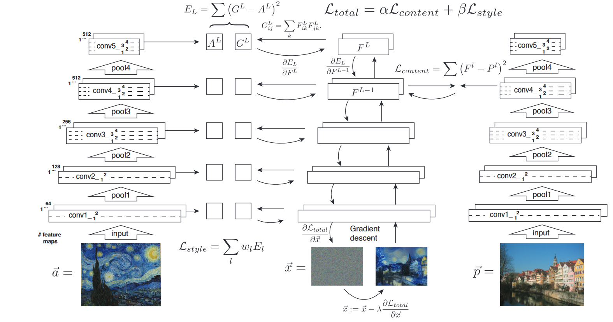
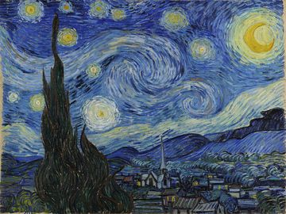
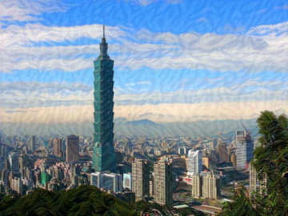
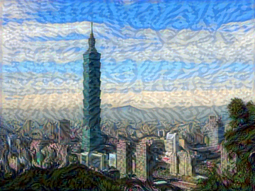
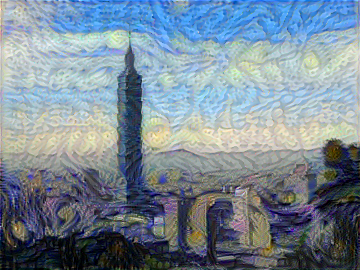
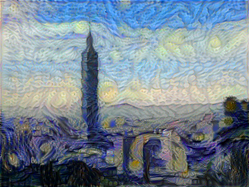
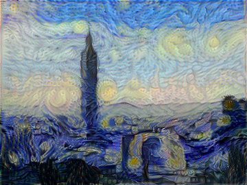
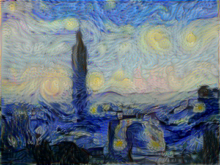
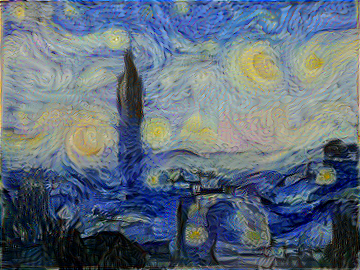
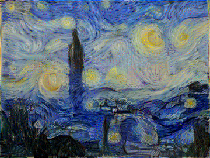

### 选题介绍
主题：神经网络在图像风格化绘制中的应用  
论文：https://arxiv.org/pdf/1508.06576v2.pdf  
本文构建了一个基于深度卷积神经网络的智能系统，绘制出具有艺术价值的图像。对于任意图片，该系统将使用神经元表征对其风格和内容进行分离。通过将不同艺术作品的风格特征融合到普通照片的内容特征，该方法可以对普通照片进行各式各样的艺术化的生成。 

使用VGG19网络。本来是用于物体识别的。但是认为其中编码了高级的“content”信息。而之前有研究显示在神经网络上定义的Gram矩阵可以用于提取图像的texture。把两者结合，即可实现内容和风格的融合。在VGG19的结构中选择content layer和style layer（论文分别使用conv4_2和conv1_1 -> conv5_1的集合）。计算内容图的content激活值；计算风格图的style激活值。使用这些激活值作为特征。从白噪声开始，优化损失函数。最后得到结果。 

### 论文方法介绍
输入：风格图、内容图、初始图。一个已经训练好的用于object recognition的网络（VGG19）。 
风格图大小任意。内容图和初始图大小需要一致。  
对于风格图，计算它在conv1_1, conv2_1, ..., conv5_1的Gram矩阵。这个矩阵即为“style”特征。  
以conv5_1为例。假设风格图的大小是h\*w\*3的。那么当它到达第五组卷积层时，大小为(h/16)\*(w/16)\*512。该组卷积层拥有512个过滤器(每个过滤器大小是3\*3\*512)，因此风格图在本层的原始激活值是一个(h/16)\*(w/16)\*512的矩阵。这个矩阵的转置乘以自己，变成对称阵。这个对称阵是512\*512的。它就是Gram矩阵，即风格特征。   
对于内容图，计算方法类似，只不过在conv4_2。它的激活值是(h/8)\*(w/8)\*512的矩阵。这就是内容特征。   
对于初始图，我们也可以计算出它的对应的内容特征和风格特征。它和内容图、风格图的欧氏距离（的平方）的线性加权值，即为损失函数。  

定义了上述损失函数之后，即可利用反向传播算法，逐步修改初始图的像素值。经过数次迭代可得结果。

反向传播中，最重要的应用链式法则进行求导。对于内容特征和风格特征，它们的导数分别是：

### 复现结果

 
1-2：

 
3-10：

 
20-100：

 
300-500：

 
1000-2000：

 
4000-6000：

部分loss：  
1896182600000.0  
0.0  
758473000.0  
 
0  iter  
919363600000.0  
3489884.5  
367744030.0  
 
1  iter  
558625500000.0  
9116051.0  
223446580.0  
 
2  iter  
402506700000.0  
13448317.0  
160997310.0  
 
3  iter  
321685750000.0  
16585224.0  
128667660.0  
 
4  iter  
280161400000.0  
18825416.0  
112057020.0  
 
1000  iter  
2557512200.0  
37442250.0  
1008027.94  
 
4000  iter  
514320400.0  
39685504.0  
189853.95  
 
7000  iter  
338648420.0  
39929492.0  
119487.56  
 
8000  iter  
325491460.0  
40025068.0  
114186.555  

### 结果讨论
所谓的风格化绘制，实际上是一个纹理生成的过程。 
画出两个月亮。 
星空出现在地面建筑物上。 
一栋楼被明显划分成两个物体。 
实际上只是根据每个像素点，以及这个点和它周围的点的相关关系（这个相关关系由神经网络的feature map捕捉），调整这个像素点的值，使之在一个局部范围内，具有与风格图的局部特征相似的纹理。实际上并不具备认知画作表达的语义的能力。

### 后续工作
1. 尝试从风格图开始进行优化。从而验证作者定义的Content的Style特征的确能分别表示物体的实际内容和局部纹理。 
2. 尝试直接获取多种艺术流派的多幅作品的Gram矩阵值，进行如kNN聚类，看是否Gram矩阵的确可以正确地把画作按照风格进行划分。
3. 扰乱输入模型的数值，使之失去object recognition能力，看是否仍可以用于风格生成。若是，则说明只是需要一个极其复杂的函数把所有像素点关联起来，并作为优化目标，就可以捕捉风格信息，不需要已经精确地训练好的网络。
