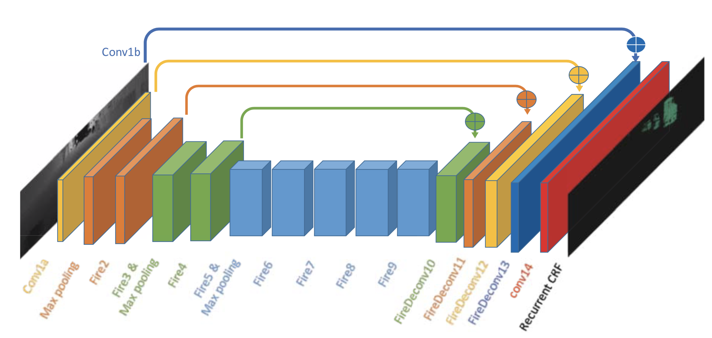
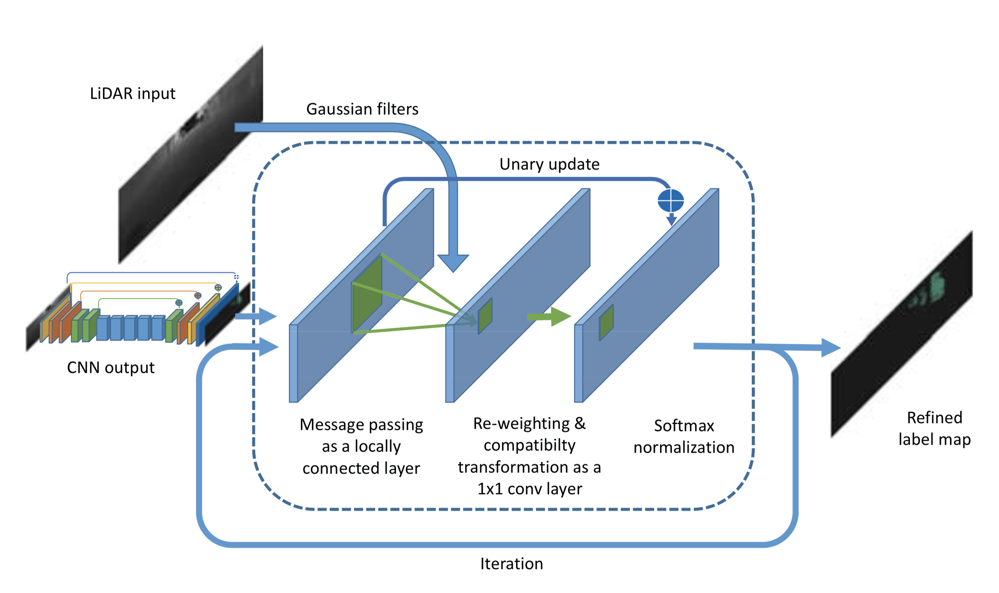

## Personal Information
* **Name**: 辛越 
* **Student ID**: 21821256
* **E-Mail:**: x1046106323@zju.edu.cn

## Schedule
| Task | Due | Done |
| :-- | :-: | :-: |
| 1. 选择论文 | Mar. 14 |  |
| 2. 精读论文，理解模型 | Mar. 21 |  |
| 3. 复现论文 | Apr. 4 |  |
| 4. 完成对比实验 | Apr. 11 |  |
| 5. 形成最后报告 | Apr. 18 |  | 

### 选择论文
[SqueezeSeg: Convolutional Neural Nets with Recurrent CRF for Real-Time Road-Object Segmentation from 3D LiDAR Point Cloud](SqueezeSeg.pdf)<br>
**Author(s)**: Bichen Wu ; Alvin Wan ; Xiangyu Yue ; Kurt Keutzer<br>
**Published in**: [2018 IEEE International Conference on Robotics and Automation (ICRA)](https://ieeexplore.ieee.org/xpl/mostRecentIssue.jsp?punumber=8449910)<br>

* #### Abstract
>We address semantic segmentation of road-objects from 3D LiDAR point clouds. In particular, we wish to detect and categorize instances of interest, such as cars, pedestrians and cyclists. We formulate this problem as a point-wise classification problem, and propose an end-to-end pipeline called SqueezeSeg based on convolutional neural networks (CNN): the CNN takes a transformed LiDAR point cloud as input and directly outputs a point-wise label map, which is then refined by a conditional random field (CRF) implemented as a recurrent layer. Instance-level labels are then obtained by conventional clustering algorithms. Our CNN model is trained on LiDAR point clouds from the KITTI dataset, and our point-wise segmentation labels are derived from 3D bounding boxes from KITTI. To obtain extra training data, we built a LiDAR simulator into Grand Theft Auto V (GTA-V), a popular video game, to synthesize large amounts of realistic training data. Our experiments show that SqueezeSeg achieves high accuracy with astonishingly fast and stable runtime (8.7 ± 0.5 ms per frame), highly desirable for autonomous driving. Furthermore, additionally training on synthesized data boosts validation accuracy on real-world data. Our source code is open-source released. The paper is accompanied by a video containing a high level introduction and demonstrations of this work.

* #### 摘要
>我们解决了3D LiDAR点云对道路上物体的语义分割问题。特别地，我们希望检测和分类感兴趣的实例，例如汽车、行人和骑自行车的人。我们将此问题描述为逐点分类问题，并提出一种基于卷积神经网络（CNN）的端到端流水线SqueezeSeg：CNN将转换后的点云作为输入并直接输出逐点的标签映射，然后被作为重复层实现的条件随机场（CRF）重新定义，之后通过传统的聚类算法获得实例级标签。我们的CNN模型使用KITTI数据集的LiDAR点云训练，我们的逐点分割标签来自于KITTI的3D bounding box。为了获取额外的训练数据，我们在流行的视频游戏“侠盗猎车手V”（GTA-V）构建了一个LiDAR模拟器，以合成大量逼真的实验数据。我们的实验表明，SqueezeSeg达到了很高的精度，具有惊人的速度和稳定的运行时间（8.7 ± 0.5 ms每帧）非常适合自动驾驶。此外，对合成数据的额外训练提高了使用真实世界数据验证的准确性。我们的源代码是开源发布的。本文附有一个视频，其中包括对这项工作的高级内容和展示。<br>
### 精读论文
#### A. Point Cloud Transformation
Unlike the distribution of image pixels, the distribution of LiDAR point clouds is usually spare and irregular. Therefore, naively discretizing a 3D space into voxels results in excessively many empty voxels. Processing such sparse data is ineffi- cient, wasting computation.
To obtain a more compact representation, we project the LiDAR point cloud onto a sphere for a dense, grid-based representation as
$$\theta=arcsin\frac{z}{\sqrt{x^2+y^2+z^2}}\\
\phi=arcsin\frac{y}{\sqrt{x^2+y^2}}\tag{1}$$
Applying equation (1) to each point in the cloud, we can obtain a 3D tensor of size $H\times W\times C$. In our experiments, we used 5 features for each point: 3 cartesian coordinates $(x, y, z)$, an intensity measurement and range $r=\sqrt{x^2+y^2+z^2}$.<br>

#### B. Network structure
The input to SqueezeSeg is a 64 × 512 × 5 tensor as described in the previous section. We ported layers (conv1a to fire9) from SqueezeNet for feature extraction. We only down-sample the width. The output of fire9 is a down-sampled feature map that encodes the semantics of the point cloud.<br>
To obtain full resolution label predictions for each point, we used deconvolution modules (more precisely, “transposed convolutions”) to up-sample feature maps in the width dimension. We used skip-connections to add up-sampled feature maps to lower-level feature maps of the same size, as shown in Fig. 3. The output probability map is generated by a convolutional layer (conv14) with softmax activation. The probability map is further refined by a recurrent CRF layer, which will be discussed in the next section.

#### C. Conditional Random Field
&emsp;&emsp;在图片语义分割中，CNN模型预测的结果边界模糊，这一般是由于在最大池化等下采样操作中丢失了低层的细节。精确的像素级别的标签预测不仅需要知道高层的语义信息，而且要获取低层的细节，后者对于标签的一致性至关重要。文中使用了条件随机场改进CNN生成的标签图。对于已知的点云和第$i$个点的预测标签$c_i$，CRF模型使用下面的能量函数
$$E(\mathbf{c})=\sum_i{u_i(c_i)} + \sum_{i,j}{b_{i,j}(c_i, c_j)}\tag{2}$$
<br>
CNN模型的输出作为初始概率图输入到CRF模型，之后使用高斯核过滤概率图，高斯核按照下面公式选取
$$\omega_1 exp(-\frac{{\parallel \mathbf{p_i}-\mathbf{p_j}\parallel}^2}{2\sigma_{\alpha}^2}-\frac{{\parallel \mathbf{x_i} - \mathbf{x_j} \parallel}^2}{2\sigma_{\beta}^2}) + \omega_2 exp(-\frac{{\parallel \mathbf{p_i}-\mathbf{p_j}\parallel}^2}{2\sigma_{\gamma}^2})\tag{3}$$
这一步也叫做信息传递，因为聚合了临近点的概率。之后通过$1\times1$的卷积核调整每个点的概率分布权重，卷积核的值通过学习获得。最后把原始概率与上一步卷积层输出叠加，并用softmax归一化处理，输出的Refined label map再次输入到RNN层进行迭代。迭代结束后得到最终的Refined label map。
### 复现论文
核心代码如下
```py
import os
import sys

import joblib
from utils import util
import numpy as np
import tensorflow as tf
from nn_skeleton import ModelSkeleton

class SqueezeSeg(ModelSkeleton):
  def __init__(self, mc, gpu_id=0):
    with tf.device('/gpu:{}'.format(gpu_id)):
      ModelSkeleton.__init__(self, mc)

      self._add_forward_graph()
      self._add_output_graph()
      self._add_loss_graph()
      self._add_train_graph()
      self._add_viz_graph()
      self._add_summary_ops()

  def _add_forward_graph(self):
    """NN architecture."""

    mc = self.mc
    if mc.LOAD_PRETRAINED_MODEL:
      assert tf.gfile.Exists(mc.PRETRAINED_MODEL_PATH), \
          'Cannot find pretrained model at the given path:' \
          '  {}'.format(mc.PRETRAINED_MODEL_PATH)
      self.caffemodel_weight = joblib.load(mc.PRETRAINED_MODEL_PATH)

    conv1 = self._conv_layer(
        'conv1', self.lidar_input, filters=64, size=3, stride=2,
        padding='SAME', freeze=False, xavier=True)
    conv1_skip = self._conv_layer(
        'conv1_skip', self.lidar_input, filters=64, size=1, stride=1,
        padding='SAME', freeze=False, xavier=True)
    pool1 = self._pooling_layer(
        'pool1', conv1, size=3, stride=2, padding='SAME')

    fire2 = self._fire_layer(
        'fire2', pool1, s1x1=16, e1x1=64, e3x3=64, freeze=False)
    fire3 = self._fire_layer(
        'fire3', fire2, s1x1=16, e1x1=64, e3x3=64, freeze=False)
    pool3 = self._pooling_layer(
        'pool3', fire3, size=3, stride=2, padding='SAME')

    fire4 = self._fire_layer(
        'fire4', pool3, s1x1=32, e1x1=128, e3x3=128, freeze=False)
    fire5 = self._fire_layer(
        'fire5', fire4, s1x1=32, e1x1=128, e3x3=128, freeze=False)
    pool5 = self._pooling_layer(
        'pool5', fire5, size=3, stride=2, padding='SAME')

    fire6 = self._fire_layer(
        'fire6', pool5, s1x1=48, e1x1=192, e3x3=192, freeze=False)
    fire7 = self._fire_layer(
        'fire7', fire6, s1x1=48, e1x1=192, e3x3=192, freeze=False)
    fire8 = self._fire_layer(
        'fire8', fire7, s1x1=64, e1x1=256, e3x3=256, freeze=False)
    fire9 = self._fire_layer(
        'fire9', fire8, s1x1=64, e1x1=256, e3x3=256, freeze=False)

    # Deconvolation
    fire10 = self._fire_deconv(
        'fire_deconv10', fire9, s1x1=64, e1x1=128, e3x3=128, factors=[1, 2],
        stddev=0.1)
    fire10_fuse = tf.add(fire10, fire5, name='fure10_fuse')

    fire11 = self._fire_deconv(
        'fire_deconv11', fire10_fuse, s1x1=32, e1x1=64, e3x3=64, factors=[1, 2],
        stddev=0.1)
    fire11_fuse = tf.add(fire11, fire3, name='fire11_fuse')

    fire12 = self._fire_deconv(
        'fire_deconv12', fire11_fuse, s1x1=16, e1x1=32, e3x3=32, factors=[1, 2],
        stddev=0.1)
    fire12_fuse = tf.add(fire12, conv1, name='fire12_fuse')

    fire13 = self._fire_deconv(
        'fire_deconv13', fire12_fuse, s1x1=16, e1x1=32, e3x3=32, factors=[1, 2],
        stddev=0.1)
    fire13_fuse = tf.add(fire13, conv1_skip, name='fire13_fuse')

    drop13 = tf.nn.dropout(fire13_fuse, self.keep_prob, name='drop13')

    conv14 = self._conv_layer(
        'conv14_prob', drop13, filters=mc.NUM_CLASS, size=3, stride=1,
        padding='SAME', relu=False, stddev=0.1)

    bilateral_filter_weights = self._bilateral_filter_layer(
        'bilateral_filter', self.lidar_input[:, :, :, :3], # x, y, z
        thetas=[mc.BILATERAL_THETA_A, mc.BILATERAL_THETA_R],
        sizes=[mc.LCN_HEIGHT, mc.LCN_WIDTH], stride=1)

    self.output_prob = self._recurrent_crf_layer(
        'recurrent_crf', conv14, bilateral_filter_weights, 
        sizes=[mc.LCN_HEIGHT, mc.LCN_WIDTH], num_iterations=mc.RCRF_ITER,
        padding='SAME'
    )

  def _fire_layer(self, layer_name, inputs, s1x1, e1x1, e3x3, stddev=0.001,
      freeze=False):
    """Fire layer constructor.
    Args:
      layer_name: layer name
      inputs: input tensor
      s1x1: number of 1x1 filters in squeeze layer.
      e1x1: number of 1x1 filters in expand layer.
      e3x3: number of 3x3 filters in expand layer.
      freeze: if true, do not train parameters in this layer.
    Returns:
      fire layer operation.
    """

    sq1x1 = self._conv_layer(
        layer_name+'/squeeze1x1', inputs, filters=s1x1, size=1, stride=1,
        padding='SAME', freeze=freeze, stddev=stddev)
    ex1x1 = self._conv_layer(
        layer_name+'/expand1x1', sq1x1, filters=e1x1, size=1, stride=1,
        padding='SAME', freeze=freeze, stddev=stddev)
    ex3x3 = self._conv_layer(
        layer_name+'/expand3x3', sq1x1, filters=e3x3, size=3, stride=1,
        padding='SAME', freeze=freeze, stddev=stddev)

    return tf.concat([ex1x1, ex3x3], 3, name=layer_name+'/concat')

  def _fire_deconv(self, layer_name, inputs, s1x1, e1x1, e3x3, 
                   factors=[1, 2], freeze=False, stddev=0.001):
    """Fire deconvolution layer constructor.
    Args:
      layer_name: layer name
      inputs: input tensor
      s1x1: number of 1x1 filters in squeeze layer.
      e1x1: number of 1x1 filters in expand layer.
      e3x3: number of 3x3 filters in expand layer.
      factors: spatial upsampling factors.
      freeze: if true, do not train parameters in this layer.
    Returns:
      fire layer operation.
    """

    assert len(factors) == 2,'factors should be an array of size 2'

    ksize_h = factors[0] * 2 - factors[0] % 2
    ksize_w = factors[1] * 2 - factors[1] % 2

    sq1x1 = self._conv_layer(
        layer_name+'/squeeze1x1', inputs, filters=s1x1, size=1, stride=1,
        padding='SAME', freeze=freeze, stddev=stddev)
    deconv = self._deconv_layer(
        layer_name+'/deconv', sq1x1, filters=s1x1, size=[ksize_h, ksize_w],
        stride=factors, padding='SAME', init='bilinear')
    ex1x1 = self._conv_layer(
        layer_name+'/expand1x1', deconv, filters=e1x1, size=1, stride=1,
        padding='SAME', freeze=freeze, stddev=stddev)
    ex3x3 = self._conv_layer(
        layer_name+'/expand3x3', deconv, filters=e3x3, size=3, stride=1,
        padding='SAME', freeze=freeze, stddev=stddev)

    return tf.concat([ex1x1, ex3x3], 3, name=layer_name+'/concat')
```
### 实验结果
以下是几张SequeezeSeg的分割结果<br>


### 总结
Sequeeze CRF中的超参数大都是根据经验设定的，这很大程度上会限制SqueezeSeg的运用场景扩展能力。如果这些超参数以学习的方式获得，或者用加入一定约束的卷积核代替，应该可以显著扩展模型的使用场景。<br>
[课程报告链接](report.pdf)