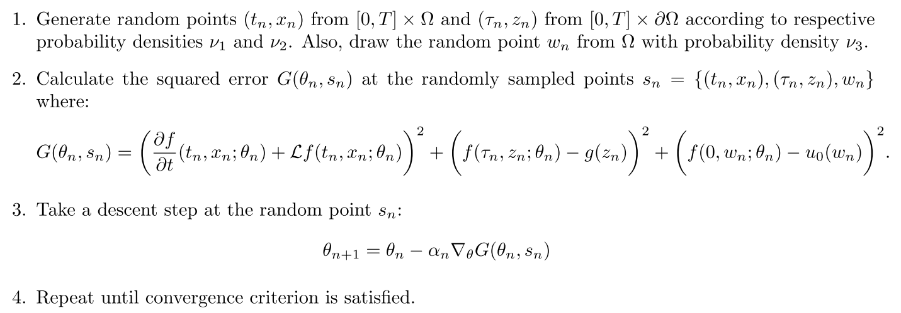
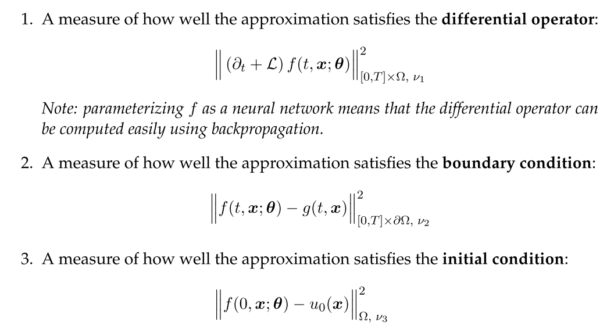
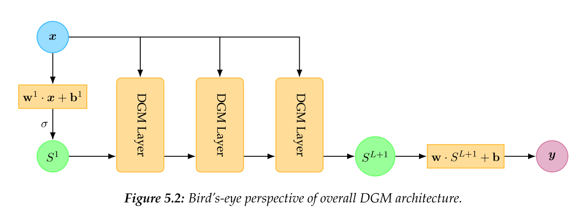
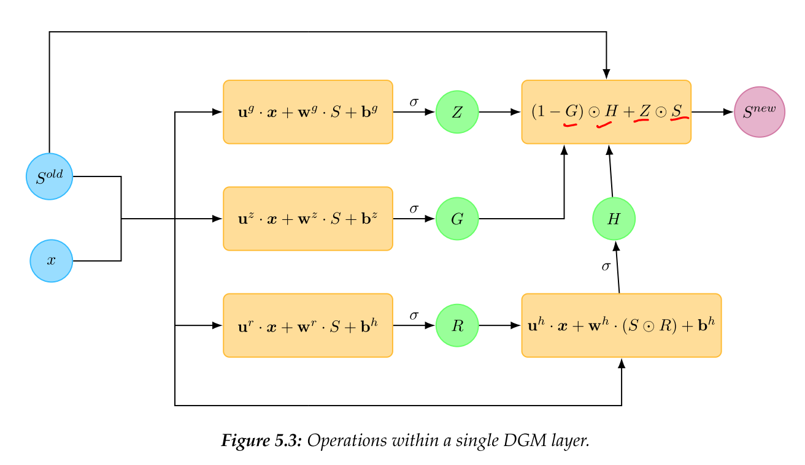

# 生物智能算法 神经网络组

## Personal information

-  name: 钟伟东
- student id: 21821073
- email: 519043202@qq.com 

## Timeine  

| Task | Due | Done |
| :-- | :-: | :-: |
| 1. 选择论文 | Mar. 14 | &radic; |
| 2. 精读论文，理解模型 | Mar. 21 | x |
| 3. 复现论文 | Apr. 4 | x |
| 4. 完成对比实验 | Apr. 11 | x |
| 5. 形成最后报告 | Apr. 18 | x |

### 1. Choose papers

[DGM: A deep learning algorithm for solving partial differential equations](https://arxiv.org/pdf/1708.07469v5.pdf)

> Journal of Computational Physics
> Volume 375, 15 December 2018, Pages 1339-1364

摘要：

> 高维偏微分方程(PDE)一直是一项长期的计算挑战。文章通过用深度神经网络近似解高维偏微分方程，神经网络经过训练以满足PDE，初始条件和边界条件。文章的算法是无网格的，通过批量随机采样的时间和空间点上训练神经网络，网格的存在会使得在较高的维度上的PDE无法求解（例如有限元，有限差分方法）。该算法在一类高维自由边界偏微分方程上进行了测试，我们能够在多达200个维度上精确求解。该算法还在高维Hamilton-Jacobi-Bellman PDE和Burgers方程上进行了测试，神经网络的解近似于Burgers方程的一般解，在连续的不同边界条件和物理条件下。算法称为“Deep Galerkin Method（DGM）”，因为它在原理上与Galerkin方法类似，其解由神经网络近似而不是基函数的线性组合。 

### 2. Read paper and understand

传统方法：

1. 确定性数值逼近方法（有限差分，有限元）
2. 随机性数值逼近方法（蒙特卡洛，离散SDE）

确定性方法：用网格计算，会有维度灾难，并且只能计算网格上的点，周边的点要用插值

随机性方法：只提供了在单一固定时空点上的值

> The above mentioned random numerical approximation methods involving Monte Carlo approximations typically overcome this curse of dimensionality but only provide approximations of the Kolmogorov PDE at a single fixed space-time point.

### 3. Implementation

[*Todo*]

### 4. Experiment

[*Todo*]

### 5. Final Report

[*Todo*]